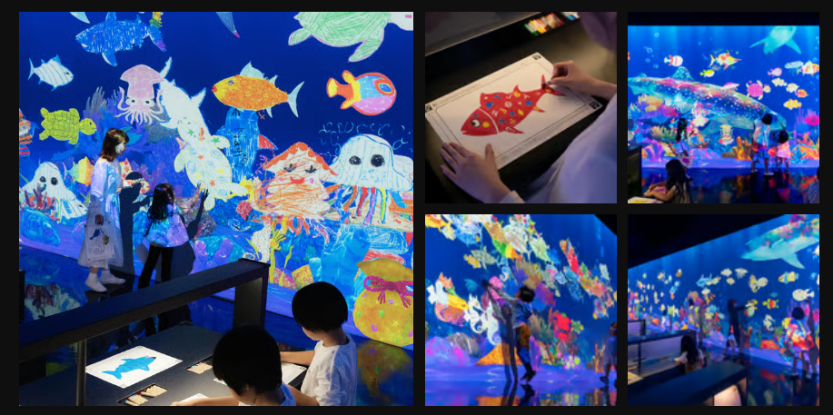

# CART-470-Project-Journal

## JOURNAL-ENTRY-WK-2 (16.9.2026 to 23.1.2026) 

### Discussion During Class

On Wednesday during class, we started the discussion about this project. Throughout the whole discussion, we basically just jumped in and voiced out the questions and ideas that came into our minds. So far, the flow seemed great because everyone was actively sharing their thoughts, and we were able to keep adding new ideas to the discussion.

At first, we had one person marking down all of our ideas. However, we found that this approach could cause us to lose some ideas, or create misunderstandings because not everyone could see exactly what was being written down. To avoid losing some of the ideas and to make the discussion easier to follow, we switched to using a live document platform. We created a Google Doc where everything could be written down live and shared between each of us. This made it easier for everyone to contribute at the same time and keep a record of our discussion.

#### Questions for Jonathan

After that, we started marking down questions for Jonathan. At this stage, we were mainly trying to understand his intention, limitations, expectations, workflow, and possible gameplay flow for the project.

Instead of immediately deciding on one solution, we wanted to keep the questions open and think about different possibilities.

Here are the questions that we think of:

- Why use a QR code?
- Do we really need to use the Phone?
- What purpose does he need it for in class?
- How do u want to implement this one
- How many people are the min/max for this prototype?
- Asking his Idea/expectation start from ppl scanning the QR code?
    - Pop-out?
    - Need username/character design first before pop-in ( green guy is me)?
- What is the QR code used for?
- What will be the vision for the project (is it mostly physical or digital)
- Do we invite students to work on it? Or use it as an example framework
- How do you want to implement it in CART415
- Will it be software or web-based? (What will be the basis for the phone connections)
    - Projectors (software/web-based)
    - Phone (software/web-based)
- What will be the expectation (is there any implementation )
- Is it that everyone controls their own character/everyone controls 1 character
- Do you think we should put the instructions on the screen?
    - Do we want to do the ppl hand stuff
- Do we invite students to work on it? Or use it as an example framework
- Do we have an end game / or continue forever?
    - Timer?
- Do we invite students to work on it? Or use it as an example framework
- Easy understanding / Experience type for the audience?
- Asking Offline / Online?

#### Inspiration and Research

We also went through the internet and did some research. We looked not only at well-developed games, but also at exhibition games and interactive installations. We started putting the links into the Google Doc so that we could keep a record of the examples we found and come back to them later.

We also experienced one of the games [Gaming Couch](https://gamingcouch.com/) ourselves and observed different parts of its display design, gameplay design, and UX design. We also found some interesting things from the experience, here are my note: 

- There was still some lag, which may have been because it was website-based and required Wi-Fi.
- If someone experienced lag, the game could pause, and there was a relatively long pause before someone could press a button to resume it.
- Each mini-game used a similar control UX on the phone, which made it easier to understand the controls when switching between games.
- There was a timer for entering the game or resuming the game.
- One player could take the role of the party leader, but the party leader was also still a player rather than just being the person controlling the computer.
- Players had names and different colours to help distinguish them from each other.

These observations gave us some ideas about things we may need to consider later, especially around connection, player identification, instructions, and the overall flow.

#### Different Approaches We Could Take

After looking at these examples, we started thinking about different possible approaches for the connection and gameplay.

Some of the ideas we listed were:

- Scanning QR codes for players to join the game
- Entering a code and all players connecting to a server
- Controller buttons appear on smartphone screens
- Phones used as Wii remotes
- Live leaderboards
- Beginning/End
- Motion Controls
- Projector
- No phone; body as controller body motion)
- Big Multiplayer game (More than 4 players can connect)
- Unity game
- Unreal Engine game
- Web game
- Spawn characters
- Show players' details on phone
- One big game
- A Collection of mini-games
- Have a homepage for the platform
- Menus / No Menus
- Have instructions / Experience the instructions
- Using a name to represent the player / different character design

At this point, we were not trying to decide which one was the final solution. We were mainly trying to understand how many different directions the project could go.

#### Inspiration Resources

We also listed the platforms, projects, and people that inspired us. We looked at Jonathan Lessard's portfolio to understand his way of working and the types of projects he has worked on. We also looked at current projects and how they present their experiences and design their workflows.

Some of the resources we found were:

- [Ludodrome](https://www.youtube.com/watch?v=482Dh5WfSg0&t=3s)
- [Ian Cheng — BOB (Bag of Belief)](https://www.youtube.com/watch?v=PdGAG5_VKZA) 
- Kahoot
- Jackbox
- Game Boy Link Cable
- Scene It / [Movie Night](https://www.youtube.com/watch?v=UXHr9OpPjWM&t=1)
- Fallout 4 / Pip-Boy
- [Gaming Couch](https://gamingcouch.com/)
- [AirConsole](https://www.airconsole.com/)
- Just Dance
- teamLab--[Sketch Aquarium: Connected World](https://www.teamlab.art/ew/aquarium/)

These examples gave us different directions to think about, especially around multiplayer interaction, physical and digital spaces, phone-based controls, and large-scale audience participation.

#### Initial Living Contract

I also started making the structure for the Living Contract. Since we still needed to have the discussion with Jonathan before the project became more settled, I did not want to make too many decisions too early.

Instead, I started by creating a structure that could be changed later as we learned more about the project.

### Questions After the Lecture

After the class discussion, we created a separate section in the Google Doc called **“Extra Questions (After the Lecture)”**.

We wanted to keep these questions separate because we thought about them after the main discussion. We did not want to mix them with the questions that we had already discussed together during class.

Here are some of the questions that I thought after the class :

- Would we scale the experience if it is presented in a bigger space? Or only classroom size?
- How would we decide whether people are reacting to something that is already happening on the screen, or actively playing a competitive game together?
- How would we create an experience where the audience is not only controlling something, but also contributing something to the screen?

### Inspire from Other Groups

I also reviewed the presentations from the other groups and found that Nat's group did a really good job with their Figma presentation and organization. Their ideas were presented very visually, which made it easier to understand the different parts of their project. I realized that this was something our meetings were missing. We had a lot of questions and ideas written down, but they were mostly in text form, so it could sometimes be difficult to see how everything was connected.

Because of this, I decided that I should also start doing some mapping for our project and use it as part of our visual presentation. Instead of only having a list of questions, I wanted to show the questions through different parts of the user flow and different scenarios. This way, we could have a better visual representation of what we are thinking about and what we still need to figure out.

I also got some additional questions and ideas from looking at the other groups' projects and presentations:

- **How would we make our project different from existing installations?**
    - Are we copying an existing installation?
    - How would we introduce something new that we can try to implement?
    - Are we mainly trying to create a similar base platform and experience, or do we want to develop our own direction from the beginning?
- **How would we consider accessibility and disability in the interaction?**
    - The idea of having the controller give a physical reaction also sounds interesting.
    - For example, could the phone shake when something happens in the game?
    - Could the phone make a sound or provide another type of feedback?
    - How would we use these different types of feedback to make the experience more accessible or immersive?

#### Re-organizing the Questions

I also discussed with some of our teammate in other class and agreed that the questions we had at this point were mainly a collection of ideas, and they needed to be reorganized.

I decided to organize them into different categories first and then present the structure in our Discord chat to see how the other teammates were thinking about it.

I also wrote down some notes from the class presentation:

- May need to change the questions from **“What”** to **“How would I…”** or **“How would we…”**
- Use more visuals to present the questions
- Could list different scenarios and see what could happen in each scenario

Because of this, I started changing the questions into **“How would …”** questions. Here are the new order of the questions that I made ( It also include some new question that I thought of :

###### Project Vision and Purpose

- What is the main idea or vision you have for this project?
- What would you like the audience to experience when they interact with it?
- How would you describe the main purpose of this project in CART 415?
- Is there a specific experience, feeling, or interaction that you want us to achieve?
- What part of the idea is most important to you?

###### Audience and Exhibition Context

- How many people do you imagine participating at the same time?
- What would be the minimum and maximum number of players we should design for?
- Is this mainly intended for the classroom, or should we think about it as something that could work in a larger exhibition space?
- How much time do you imagine one person or group spending with the experience?

###### Overall Experience and Gameplay

- How would you imagine the experience starting, from the moment someone approaches it?
- Do you imagine the experience having a clear beginning and ending, or should it be something that can continue?
- Would you want players to compete against each other, or participate together toward the same goal?
- Should everyone control their own character, or could everyone control/interact with one shared thing?
- How would you imagine players knowing what they are supposed to do?
- Do you want instructions to be explicitly shown, or would you prefer the interaction itself to teach the player?
- Would you imagine one large game, or a platform that could contain multiple smaller games/experiences?
- Should players be able to join or leave while the experience is already running?

###### Phone and Player Interaction

- Why is the QR code important to the concept?
- How would you imagine the process working after someone scans the QR code?
- Would players need to enter a username, choose a colour, or choose a character?
- How should each player be represented on the main screen?
- Would you want the phone to function mainly as a traditional controller, or could it have other interactions?

###### Multiplayer and Social Interaction

- How would you like the players to interact with each other?
- Should there be a party leader/host, or should everyone have an equal role?
- Should the person managing the main screen also be able to participate as a player?
- Is there a specific number of players you would like us to target for the prototype?
- How should the experience respond if one player disconnects or has connection problems?

###### Physical Space and Display

- Is the large screen mainly for displaying the game, or do you imagine the physical space itself being part of the experience?
- How would you like the audience to interact with the screen?
- Do you imagine people standing, sitting, moving around, or doing something physical while playing?
- Are there any limitations on the physical space that we should know about?

###### Technical Direction

- Do you have any technical requirements or limitations that we should know about?
- Is there a preferred platform for the project? (Software/ web-based?)
- Are there any limitations regarding Wi-Fi, internet access, computers, projectors, or other hardware?

###### CART 415 and Project Scope

- How would we understand the main purpose of this project?
- How would you like us to approach this project as a CART 415 class?
- Are we developing a finished experience, or are we developing a framework/prototype that could later be expanded?
- Would you want future students to be able to build on what we create?
- What limitations should we keep in mind from the beginning?

###### Open Discussion

- Is there anything you already have in mind that we haven't asked about?
- Are there any ideas you definitely want us to explore?
- Are there any approaches you definitely do not want us to take?
- What would make you feel that we have successfully achieved the goal of this project?
- Is there anything from our current ideas or questions that you would like us to rethink?

### User Flow and Visual Mapping

After reorganizing the questions, I started working on the visual presentation.

I created a mapping for the user flow and started putting different scenarios, questions, and unresolved decisions onto the map. 

Here is the link: [User Flow Mapping](https://www.figma.com/board/yNiY1W6W2cBil1E87i0YtZ/Untitled?node-id=0-1&p=f&t=754KNJgZEcPLH0Vg-0)

The goal of the map was to show the different questions at different points in the user experience, starting from platform opens and ending when they finish the experience.

**Start the Platform→ joins the platform(appears in the game) → Host control→ Game play → reaches the ending ( End Game Decision & Next Game Decision)**

The mapping still needs to be refined and discussed more with the teammates. However, I think it is already useful because it lists the minimum decisions we need to make at different steps of the user flow.

I also think the visual map can improve how we present our concerns. Instead of only showing a long list of questions, we can show **where** each question happens in the experience and how one decision can affect the next part of the flow.

### TeamLab and Further Inspiration

At the end, I also found some real-world examples from [teamLab](https://www.teamlab.art/ew/aquarium/) and looked more closely at how they create interactive experiences for groups of people.

This gave me another question that connects with some of our previous discussions:

**How would we decide whether the experience should be competitive, or whether everyone participates together to create something that appears on the big screen?**

For example, if everyone is creating something together, the experience could continue without necessarily having a winner or loser. On the other hand, if we make it competitive, we may need a clear ending, score, timer, or winner.

This also connects to our previous question about whether the game should continue forever or have an end state.

I think this is something we can discuss not only from the gameplay side, but also from the artistic side. How would we use the artistic direction of the project to decide how people participate, what they see on the screen, and how their actions contribute to the overall experience?

### Next Steps

As we discussed the roles before, there are still many questions that need to be confirmed before we can move further.

The biggest things we need to clarify are:

- Jonathan's expectations
- The purpose of the project
- The project scope
- The intended audience
- The space where it will be presented
- The number of players
- The role of the phone
- The connection method
- The overall gameplay structure
- Whether the experience is competitive or collaborative
- Whether the project is a framework or a finished experience
- The platform and technology we should use

Because there are still many things to confirm, I think the client meeting with Jonathan will be very important for our next step. Once we have a better understanding of the expectations and limitations, we can start narrowing down our ideas and deciding where we can put our own creativity into the project.

### Progress So Far

Overall, I think the progress so far is pretty good.

The group communication is good, and everyone is willing to share their thoughts and come up with ideas. I think the Google Doc also helped us keep track of the discussion because we were able to write things down together instead of relying on only one person to record everything.

I also think that creating the question categories and the user-flow mapping helped us move from just having a long list of random questions toward something more organized and visual.

There are still many things that we need to figure out, especially the client expectations and project scope. For next week, hope that after the client meeting, we can clarify more details about the project and start turning some of these questions into actual design directions.

For now, I think it is better that we are keeping the questions open instead of deciding too quickly. Once we understand what all expectations from the project, we can start looking at these different possibilities and figure out how we can make the project more creative and interesting.
 
## JOURNAL-ENTRY-WK-3 CLIENT INTRODUCTION MEETING (24.9.2026 to 30.1.2026) 

#### Before the Client Meeting

Before we started meeting with the client, we first went over what we did during the previous week. I shared the user-flow map that I made, since I wanted the team to see how I organized the questions and different possibilities visually.

At the same time, Hubert was the first person who put together an improved version of the questions. So instead of completely starting over with each of our own versions, we based our discussion on his questions and added some of the interesting questions that we thought were missing.

I think this was already a good example of how our team is working together. Instead of everyone making a completely separate version, we were able to take one person's work and build on it. We still had different ideas, but we were putting them together rather than making the same work twice.

#### Client Meeting with Jonathan

We then started our client meeting with Jonathan. The meeting went quite smoothly, and we actually did not follow the list of questions that we prepared very strictly.

At first, I thought we would go through the questions one by one. However, as Jonathan explained his perspective and vision for the project, many of our questions were already answered naturally through the conversation. Instead of interrupting the conversation just to ask the next question on our list, we followed the flow of the discussion and asked questions when they became relevant.

I think this was one of the things that we did well during the meeting. We did not just treat the question list like an interview checklist. We listened to what Jonathan was explaining and used our questions to clarify the things that were still unclear.

I think this way is also a good way to reduce misunderstanding between the client and us, but also between our internal team members. If we all hear the same explanation directly from the client, we can have the same understanding of what he means instead of one person explaining it to the rest of the group later.

So, although we prepared a lot of questions, the meeting showed me that preparation is not only about having a long list of questions. It is also about understanding what we need to listen for and being able to adapt when the client gives us information in a different way.

### What Changed After Talking to Jonathan

After the meeting, we realized that there was a bigger difference between what we originally thought the project was and what Jonathan was actually expecting.

Last week, I was thinking more about the project as if we were going to develop a game or platform that could eventually be delivered.

After talking with Jonathan, we now understand that the project is more about **exploring possibilities and reducing risks before CART 415 starts developing the actual game**.

It is more like a preparation, testing, and game-design phase.

Instead of trying to deliver a full game, we are now:

- Explore different ideas
- Develop different possible directions
- Identify potential problems
- Compare the pros and cons of different approaches
- Create low prototypes
- Create wireframes
- Create pre-production concepts
- Walk through possible game flows
- Test whether an idea could realistically work
- Present different options to Jonathan
- Use his feedback to decide which direction could be developed later

This changed the way I think about our project.

Jonathan does not want us to spend all of the available time making one idea, only to discover in the middle of CART 415 that the idea does not work. He wants us to explore and test the possibilities now, so that the next group can start with a better understanding of what works and what does not.

In this way, our project can help reduce the risk for the future CART 415 students.

### The CART 415 Constraint

One thing that became especially important to me was the timeline for CART 415.

The future students will only have around 10–12 weeks to actually make the game. Because of this, an idea can sound very interesting or creative but still be unrealistic if it is too complicated to implement or too difficult for students to understand and continue from.

Jonathan also mentioned that Emma could be useful in giving us another perspective because she will be taking CART 415 in the coming Winter semester. Since some of us in the current group are close to graduating, we may think about the project differently from someone who will actually be taking the course and developing the game afterward.

Emma can help us think about questions such as:

- Would this idea actually be possible to implement in the course?
- Would the students have enough time?
- Would the onboarding be too complicated?
- Would the students need to learn too many new technologies?
- Would the idea be too ambitious for a 10–12 week development period?
- What would a future CART 415 student want or not want to inherit from our project?

I think this is an important limitation to keep in mind when we are generating ideas.

It means that we should not only ask:

> “Is this idea interesting?”
> 

We should also ask:

> “Could a CART 415 student realistically make this?”
> 

This gives us another way to evaluate our prototypes and ideas.

#### How My User Flow Map Needs to Change

Because of this new understanding, I also realized that my user-flow map may not be used in exactly the same way as I originally imagined.

Originally, I was thinking about the map as a way to define the user experience, starting from the player entering the platform and going through each step until the end, such as reaching a confirmation.

But now I think the map can be more useful as a way to show **different possibilities**.

For example, instead of saying:

> Player joins → Player chooses character → Player plays → Game ends
> 

we could show different possible directions at each point:

> Player joins
> 
> 
> → QR code / code / other connection
> 
> → individual character / shared character
> 
> → competitive / collaborative
> 
> → mini-game / one continuous game
> 
> → timer / no timer
> 
> → ending / infinite experience
> 

Then we can discuss the different possibilities with Jonathan and compare their pros and cons.

This is more useful for our current project because we are not trying to lock down one final user flow yet. We are trying to explore what could work.

Different game ideas may also benefit from different mechanics or actions in the user flow. So the map can help us see combinations of mechanics and how they could affect the overall experience.

I think the map can therefore become more of an **ideation and comparison tool**, rather than only a final user-flow document.

#### Timeline

During the meeting, we also asked Jonathan about the timeline from his perspective.

Based on the second meeting and the final presentation date , we started to build a rough timeline and time block for the project.

The idea seems to be that we should have several options or ideas developed with low-fidelity prototypes before the second major discussion. After that, we can compare the options and use the feedback to decide which direction makes the most sense to develop further.

This makes the timeline feel more like:

**Explore → Prototype → Compare → Get feedback → Narrow down → Develop further**

rather than:

**Choose one idea → Build the whole game → Deliver**

Now it becomes a much clearer way for me to understand what we are actually supposed to produce.

#### Keeping the Ideas Simple

One thing Jonathan mentioned that stayed in my mind was that **simple is better**.

This is interesting because we have already come up with many ideas that are quite complicated. It is easy for us to think of something that sounds fun, but the challenge is figuring out how to move from the idea to something that can actually work within the timeline.

For example, we discussed using camera capture for motion controls on the big screen. This could be interesting, but it could also create more technical problems and require more time.

We also discussed the possibility of not having too much onboarding information on the big screen because it could become a distraction from the actual experience. Instead, some of the instructions could potentially be on the smaller screen or phone.

So I think the question now is not just:

> “What can we make?”
> 

but also:

> “What can we realistically make well within the timeline?”
> 

So, this is something I want to keep in mind when I continue generating ideas.

#### Documentation From the Meeting

During the meeting, each of us took our own notes about our discussion with Jonathan.

We also took pictures of Jonathan's drawings and the games/examples that he described. I think this will be useful because the drawings are another way of documenting the client's thinking. Sometimes it is difficult to fully understand an idea from only written notes, especially when the client is explaining a gameplay concept visually.

Looking back at these drawings also gives us another way to understand Jonathan's vision and can help us generate ideas later. If we only remember the meeting from our own memory, different team members may remember different things. Having the drawings, notes, and discussions documented gives us something that we can come back to.

### Learning Living Contract

For the Learning Living Contract, we also made some edits and started organizing it into a clearer table.

Right now, there are still many possibilities, but after more discussion and prototyping later, we should have a clearer path for what we actually want to focus on. 

##### Learning Beyond Technical Skills

Another thing I reflected on this week came from talking with Sabine about the learning objectives that need to be write in the Contract. 

Because our project is becoming more research- and prototype-based, it can sometimes be difficult to describe what we are learning only through technical skills.

However, I realized that the skills we are learning through the process are also important.

For example:

- Communicating with a client
- Understanding and responding to client needs
- Communicating with teammates
- Documenting decisions
- Managing project risks
- Comparing different possibilities
- Setting a realistic timeline
- Presenting ideas clearly
- Understanding limitations
- Working with feedback
- Making decisions as a team

Some of these may seem like basic things, such as team communication, but I think they are actually important professional skills.

As in the last year of my program, I have heard people mention many times that real-world work involves constantly communicating with your team, your client, and your manager. It is not only about making something based on what we have in our mind .

For example, how do you pass your work to another person without it being misunderstood?

The same thing applies to our project. If we document our decisions, questions, prototypes, and feedback, another person can understand why we made certain decisions instead of only seeing the final result.

The timeline also works in a similar way. Setting milestones helps move the project continuously instead of having everyone work separately without knowing what needs to happen next.

### Ideas I Started Exploring

After the meeting, I started thinking about some possible prototype ideas.

At this stage, I did not want to limit myself too much. I wanted to list what could be possible first and then think about the pros and cons afterward.

Even if an idea does not work, I think it can still be useful to document it. Like Later, during our next meeting, we can understand why the idea did not work, and sometimes even an unsuccessful idea can also inspire another teammate's idea.

He mentioned that it could be interesting to focus on the **artistic side** of the experience, so I also think about how visual and audio elements could become part of the gameplay.

#### Music / Visual Matching Game Idea

I recently attended a workshop at school about a creative tool called **Ossia**, which is similar to TouchDesigner. It allows you to work with soundtracks, visuals, effects, and video, as well as explore different ways to combine them and create fun interactions between them.

This made me think about a possible game where the player controls something similar to the number up/down game that Jonathan mentioned, where the player clicks the up/down buttons to change a value and let them to reach a target number combination. Instead of simply changing a number, however, the player’s actions could affect or match a video, sound, or visual effect.

The player could interact with the controller and the visual result would change on the big screen.

#### Cutting Vegetables Game Idea

Another idea is a vegetable-cutting game, similar to the *Veggie Slice Frenzy* game, where players slice vegetables as they appear on the screen. When a vegetable is cut, its juice could spread across the screen and create colourful effects, somewhat like *Splatoon*.

 Veggie Slice Frenzy Game: Free Online Untimed Vegetable Slicing Video Game for Kids , 
 Splatoon Base: Learn about the world of Splatoon | Nintendo

The vegetables or fruits could fall from the top of the screen, and players would interact with them using their phones.

One possibility is that as more people join, the vegetables could fall faster.

**Pros:**

- More players could make the experience more exciting
- The increasing speed could encourage other people to join
- The colourful effects could make the game more visually engaging

**Cons:**

- Drag interactions on the phone could create delays or make the interaction feel less responsive
- More players could make the screen more difficult to follow
- If the phone display shows the same vegetable positions as the big screen, there could be a problem where two or more players try to cut the same vegetable at the same time. (This could create a conflict in the user flow, so we would need to consider how to assign vegetables to different players or otherwise handle simultaneous interactions.)

#### Maze Game Idea

Another idea is a maze game where the player needs to move a character through the maze and find the way out. One possibility is that the walking speed becomes faster as more players join.

However, one problem is:

> If multiple players are controlling the same character, who controls up, left, right, and down?
> 

Through this, I also come up another possibility is that each player has their own character and needs to collect items, such as gems, throughout the maze. The maze could also change at certain intervals, such as every 5 , 10 , 15 seconds, by moving or rearranging some of the blocks. 

Pros :

- This could make the game more unpredictable and encourage players to quickly adapt to the changing maze.
- using the walking speed becomes faster as more players join.

Cons:

- With multiple players on the same maze, the screen could become crowded and difficult to follow.

#### Block-Pushing Game Idea

I also thought more about Jonathan's idea of pushing blocks to move a larger character.

One possible version could be:

- Players move blocks together
- The blocks are used to move a large character / active an big action ( like let a big ship move
- The game counts how long it takes to solve the problem
- Players need to work together to reach the goal

But this immediately creates another question.

**What happens if the block gets stuck in a deadlock?**

For example, if a player pushes a block into the wrong position, or if one player leaves the game, how would the group restart or recover?

We actually discussed the player-leaving problem during the meeting. Alex suggested that a player who leaves could potentially turn into a ghost. This made me think about another possible direction, the ghost game idea.

#### Ghost Game idea

Instead of treating the ghost as only a problem caused by someone leaving, what if ghosts became part of the gameplay?

For example, players could work together to kill or remove ghosts.

A possible scaling system could be:

- 1 player → can remove 1 ghost at a time
- 2 players → can remove 3 ghosts at a time
- 3 players → can remove 6 ghosts at a time

The idea would be to make joining the game more useful because having more players changes what the group can do. 

Pros :

- It could also encourage people watching to join because the experience becomes more interesting when more people participate.

For the timing, I was thinking about something like a 5-minute session because Jonathan mentioned that we should avoid losing the player's interest if the experience continues for too long.

Another possibility is making it infinite, where players can continue until they decide to leave. If we use a timed or score-based version, we could potentially also have a leaderboard. 

However, these are still only ideas. I don't think we should decide on one yet.

### More Questions for the Next Stage

After thinking about the mini-game possibilities, I also realized that there are still many questions that we need to explore.

For example, if we make a mini-game:

- How would the game start?
- Would everyone need to be ready before the game begins?
- What happens if someone joins after the game has already started?
- How long should one round last?
- What happens if someone leaves?
- How would the game restart?
- How would we make the experience easy for someone who joins without knowing the rules?
- How would the game change when more people join?

These questions are different from the questions we asked Jonathan at the beginning.

Before the client meeting, many of our questions were focused on understanding the project. Now that we understand the project better, our questions are becoming more about testing and comparing possible solutions.

I think this is an important change in our process. We can discuss these questions as a group in our next meeting, but we may not need to solve all of them right away. Instead, as we develop more ideas for each of us game concept, we can explore more different situations and possibilities through prototypes and let Jonathan review them and provide feedback.

### Reflection

Overall, I think this week gave me a much clearer understanding of what our project actually is.

There were many changes between what we expected at the beginning and what Jonathan is actually aiming for. Originally, we thought we might be developing and delivering a game or platform ourselves. Now we understand that our work is more like a testing and preparation phase for the future CART 415 students. We are exploring different possibilities, identifying potential problems, creating prototypes, and helping Jonathan understand which directions could realistically work.

This also changes how I should approach my own work. I should not immediately choose one idea and spend a lot of time developing it. Instead, I should first explore several possibilities, identify their pros and cons, and think about what could realistically be completed within the CART 415 timeline. I also think my user-flow map should follow this change. Rather than using it only to define one final experience, I can use it to show different possible paths and compare different mechanics.

For me, the biggest learning from this week is that a project can change significantly through communication and collaboration with the client. I realized that client communication is not simply about presenting our ideas and receiving feedback. It is also about understanding the client’s needs, asking the right questions, and being willing to reconsider our original ideas based on what we learn. At the same time, working as a large team means we need to communicate with each other and keep our individual ideas connected to the same project direction. This experience helped me understand that handling a client-based project is not always a linear process. Our ideas, prototypes, and decisions can continue to change as we communicate, test, and better understand the project.

### Next Steps

At the end of the class, we agreed that everyone is now more or less on the same track. We still have ideas to explore, but we now have a clearer understanding of what we are supposed to deliver.

So our next step is to come back next week with some possible prototype directions and continue discussing which ones are realistic, interesting, and useful for the future CART 415 students.
