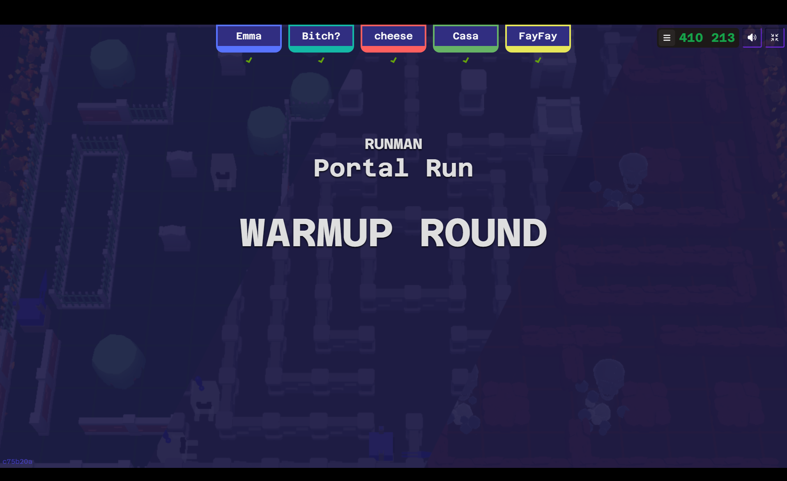

# CART-470-Project-Journal

## Week1 (16.9.2026 to 23.1.2026) 

### Discussion During Class

On Wednesday during class, we started the discussion about this project. Throughout the whole discussion, we basically just jumped in and voiced out the questions and ideas that came into our minds. So far, the flow seemed great because everyone was actively sharing their thoughts, and we were able to keep adding new ideas to the discussion.

At first, we had one person marking down all of our ideas. However, we found that this approach could cause us to lose some ideas, or create misunderstandings because not everyone could see exactly what was being written down. To avoid losing some of the ideas and to make the discussion easier to follow, we switched to using a live document platform. We created a Google Doc where everything could be written down live and shared between each of us. This made it easier for everyone to contribute at the same time and keep a record of our discussion.

#### Questions for Jonathan

After that, we started marking down questions for Jonathan. At this stage, we were mainly trying to understand his intention, limitations, expectations, workflow, and possible gameplay flow for the project.

Instead of immediately deciding on one solution, we wanted to keep the questions open and think about different possibilities.

Here are the questions that we think of:

- Why use a QR code?
- Do we really need to use the Phone?
- What purpose does he need it for in class?
- How do u want to implement this one
- How many people are the min/max for this prototype?
- Asking his Idea/expectation start from ppl scanning the QR code?
    - Pop- out?
    - Need username/character design first before pop-in ( green guy is me >?
- What is the QR code used for?
- What will be the vision for the project (is it mostly physical or digital)
- Do we invite students to work on it? Or use it as an example framework
- How do you want to implement it in CART415
- Will it be software or web-based? (What will be the basis for the phone connections)
    - Projectors (software/web-based)
    - Phone (software/web-based)
- What will be the expectation (is there any implementation )
- Is it that everyone controls their own character/everyone controls 1 character
- Do you think we should put the instructions on the screen?
    - Do we want to do the ppl hand stuff
- Do we invite students to work on it? Or use it as an example framework
- Do we have an end game / or continue forever?
    - Timer?
- Do we invite students to work on it? Or use it as an example framework
- Easy understanding / Experience type for the audience?
- Asking Offline / Online?

#### Inspiration and Research

We also went through the internet and did some research. We looked not only at well-developed games, but also at exhibition games and interactive installations. We started putting the links into the Google Doc so that we could keep a record of the examples we found and come back to them later.

We also experienced one of the games [Gaming Couch](https://gamingcouch.com/) ourselves and observed different parts of its display design, gameplay design, and UX design. We also found some interesting things from the experience, here are my note: 

- There was still some lag, which may have been because it was website-based and required Wi-Fi.
- If someone experienced lag, the game could pause, and there was a relatively long pause before someone could press a button to resume it.
- Each mini-game used a similar control UX on the phone, which made it easier to understand the controls when switching between games.
- There was a timer for entering the game or resuming the game.
- One player could take the role of the party leader, but the party leader was also still a player rather than just being the person controlling the computer.
- Players had names and different colours to help distinguish them from each other.

These observations gave us some ideas about things we may need to consider later, especially around connection, player identification, instructions, and the overall flow.

#### Different Approaches We Could Take

After looking at these examples, we started thinking about different possible approaches for the connection and gameplay.

Some of the ideas we listed were:

- Scanning QR codes for players to join the game
- Entering a code and all players connecting to a server
- Controller buttons appear on smartphone screens
- Phones used as Wii remotes
- Live leaderboards
- Beginning/End
- Motion Controls
- Projector
- No phone; body as controller body motion)
- Big Multiplayer game (More than 4 players can connect)
- Unity game
- Unreal Engine game
- Web game
- Spawn characters
- Show players' details on phone
- One big game
- A Collection of mini-games
- Have a homepage for the platform
- Menus / No Menus
- Have instructions / Experience the instructions
- Using a name to represent the player / different character design

At this point, we were not trying to decide which one was the final solution. We were mainly trying to understand how many different directions the project could go.

#### Inspiration Resources

We also listed the platforms, projects, and people that inspired us. We looked at Jonathan Lessard's portfolio to understand his way of working and the types of projects he has worked on. We also looked at current projects and how they present their experiences and design their workflows.

Some of the resources we found were:

- [Ludodrome](https://www.youtube.com/watch?v=482Dh5WfSg0&t=3s)
- [Ian Cheng — BOB (Bag of Belief)](https://www.youtube.com/watch?v=PdGAG5_VKZA) 
- Kahoot
- Jackbox
- Game Boy Link Cable
- Scene It / [Movie Night](https://www.youtube.com/watch?v=UXHr9OpPjWM&t=1)
- Fallout 4 / Pip-Boy
- [Gaming Couch](https://gamingcouch.com/)
- [AirConsole](https://www.airconsole.com/)
- Just Dance
- teamLab--[Sketch Aquarium: Connected World](https://www.teamlab.art/ew/aquarium/)

These examples gave us different directions to think about, especially around multiplayer interaction, physical and digital spaces, phone-based controls, and large-scale audience participation.

#### Initial Living Contract

I also started making the structure for the Living Contract. Since we still needed to have the discussion with Jonathan before the project became more settled, I did not want to make too many decisions too early.

Instead, I started by creating a structure that could be changed later as we learned more about the project.

## Questions After the Lecture

After the class discussion, we created a separate section in the Google Doc called **“Extra Questions (After the Lecture)”**.

We wanted to keep these questions separate because we thought about them after the main discussion. We did not want to mix them with the questions that we had already discussed together during class.

Here are some of the questions that I thought after the class :

- Would we scale the experience if it is presented in a bigger space? Or only classroom size?
- How would we decide whether people are reacting to something that is already happening on the screen, or actively playing a competitive game together?
- How would we create an experience where the audience is not only controlling something, but also contributing something to the screen?

## Inspire from Other Groups

I also reviewed the presentations from the other groups and found that Nat's group did a really good job with their Figma presentation and organization. Their ideas were presented very visually, which made it easier to understand the different parts of their project. I realized that this was something our meetings were missing. We had a lot of questions and ideas written down, but they were mostly in text form, so it could sometimes be difficult to see how everything was connected.

Because of this, I decided that I should also start doing some mapping for our project and use it as part of our visual presentation. Instead of only having a list of questions, I wanted to show the questions through different parts of the user flow and different scenarios. This way, we could have a better visual representation of what we are thinking about and what we still need to figure out.

I also got some additional questions and ideas from looking at the other groups' projects and presentations:

- **How would we make our project different from existing installations?**
    - Are we copying an existing installation too closely?
    - How would we introduce something new that we can try to implement?
    - Are we mainly trying to create a similar base platform and experience, or do we want to develop our own direction from the beginning?
- **How would we consider accessibility and disability in the interaction?**
    - The idea of having the controller give a physical reaction also sounds interesting.
    - For example, could the phone shake when something happens in the game?
    - Could the phone make a sound or provide another type of feedback?
    - How would we use these different types of feedback to make the experience more accessible or immersive?

### Re-organizing the Questions

I also discussed with some of our teammate in other class and agreed that the questions we had at this point were mainly a collection of ideas, and they needed to be reorganized.

I decided to organize them into different categories first and then present the structure in our Discord chat to see how the other teammates were thinking about it.

I also wrote down some notes from the class presentation:

- May need to change the questions from **“What”** to **“How would I…”** or **“How would we…”**
- Use more visuals to present the questions
- Could list different scenarios and see what could happen in each scenario

Because of this, I started changing the questions into **“How would we…”** questions. I found that this made the questions feel more natural and focused more on the design process instead of simply asking for an answer.

Here are the new order of the questions that I made ( It also include some new question that I thought of :

##### Project Vision and Purpose

- What is the main idea or vision you have for this project?
- What would you like the audience to experience when they interact with it?
- How would you describe the main purpose of this project in CART 415?
- Is there a specific experience, feeling, or interaction that you want us to achieve?
- What part of the idea is most important to you?

##### Audience and Exhibition Context

- How many people do you imagine participating at the same time?
- What would be the minimum and maximum number of players we should design for?
- Is this mainly intended for the classroom, or should we think about it as something that could work in a larger exhibition space?
- How much time do you imagine one person or group spending with the experience?

##### Overall Experience and Gameplay

- How would you imagine the experience starting, from the moment someone approaches it?
- Do you imagine the experience having a clear beginning and ending, or should it be something that can continue?
- Would you want players to compete against each other, or participate together toward the same goal?
- Should everyone control their own character, or could everyone control/interact with one shared thing?
- How would you imagine players knowing what they are supposed to do?
- Do you want instructions to be explicitly shown, or would you prefer the interaction itself to teach the player?
- Would you imagine one large game, or a platform that could contain multiple smaller games/experiences?
- Should players be able to join or leave while the experience is already running?

##### Phone and Player Interaction

- Why is the QR code important to the concept?
- How would you imagine the process working after someone scans the QR code?
- Would players need to enter a username, choose a colour, or choose a character?
- How should each player be represented on the main screen?
- Would you want the phone to function mainly as a traditional controller, or could it have other interactions?

##### Multiplayer and Social Interaction

- How would you like the players to interact with each other?
- Should there be a party leader/host, or should everyone have an equal role?
- Should the person managing the main screen also be able to participate as a player?
- Is there a specific number of players you would like us to target for the prototype?
- How should the experience respond if one player disconnects or has connection problems?

##### Physical Space and Display

- Is the large screen mainly for displaying the game, or do you imagine the physical space itself being part of the experience?
- How would you like the audience to interact with the screen?
- Do you imagine people standing, sitting, moving around, or doing something physical while playing?
- Are there any limitations on the physical space that we should know about?

##### Technical Direction

- Do you have any technical requirements or limitations that we should know about?
- Is there a preferred platform for the project? (Software/ web-based?)
- Are there any limitations regarding Wi-Fi, internet access, computers, projectors, or other hardware?

##### CART 415 and Project Scope

- How would we understand the main purpose of this project?
- How would you like us to approach this project as a CART 415 class?
- Are we developing a finished experience, or are we developing a framework/prototype that could later be expanded?
- Would you want future students to be able to build on what we create?
- What limitations should we keep in mind from the beginning?

##### Open Discussion

- Is there anything you already have in mind that we haven't asked about?
- Are there any ideas you definitely want us to explore?
- Are there any approaches you definitely do not want us to take?
- What would make you feel that we have successfully achieved the goal of this project?
- Is there anything from our current ideas or questions that you would like us to rethink?

## User Flow and Visual Mapping

After reorganizing the questions, I started working on the visual presentation.

I created a mapping for the user flow and started putting different scenarios, questions, and unresolved decisions onto the map. 

Here is the link: [User Flow Mapping](https://www.figma.com/board/yNiY1W6W2cBil1E87i0YtZ/Untitled?node-id=0-1&p=f&t=754KNJgZEcPLH0Vg-0)

The goal of the map was to show the different questions at different points in the user experience, starting from platform opens and ending when they finish the experience.

**Start the Platform→ joins the platform(appears in the game) → Host control→ Game play → reaches the ending ( End Game Decision & Next Game Decision)**

The mapping still needs to be refined and discussed more with the teammates. However, I think it is already useful because it lists the minimum decisions we need to make at different steps of the user flow.

I also think the visual map can improve how we present our concerns. Instead of only showing a long list of questions, we can show **where** each question happens in the experience and how one decision can affect the next part of the flow.

## TeamLab and Further Inspiration

At the end, I also found some real-world examples from [teamLab](https://www.teamlab.art/ew/aquarium/) and looked more closely at how they create interactive experiences for groups of people.

This gave me another question that connects with some of our previous discussions:

**How would we decide whether the experience should be competitive, or whether everyone participates together to create something that appears on the big screen?**

For example, if everyone is creating something together, the experience could continue without necessarily having a winner or loser. On the other hand, if we make it competitive, we may need a clear ending, score, timer, or winner.

This also connects to our previous question about whether the game should continue forever or have an end state.

I think this is something we can discuss not only from the gameplay side, but also from the artistic side. How would we use the artistic direction of the project to decide how people participate, what they see on the screen, and how their actions contribute to the overall experience?

## Next Steps

As we discussed the roles before, there are still many questions that need to be confirmed before we can move further.

The biggest things we need to clarify are:

- Jonathan's expectations
- The purpose of the project
- The project scope
- The intended audience
- The space where it will be presented
- The number of players
- The role of the phone
- The connection method
- The overall gameplay structure
- Whether the experience is competitive or collaborative
- Whether the project is a framework or a finished experience
- The platform and technology we should use

Because there are still many things to confirm, I think the client meeting with Jonathan will be very important for our next step. Once we have a better understanding of the expectations and limitations, we can start narrowing down our ideas and deciding where we can put our own creativity into the project.

## Progress So Far

Overall, I think the progress so far is pretty good.

The group communication is good, and everyone is willing to share their thoughts and come up with ideas. I think the Google Doc also helped us keep track of the discussion because we were able to write things down together instead of relying on only one person to record everything.

I also think that creating the question categories and the user-flow mapping helped us move from just having a long list of random questions toward something more organized and visual.

There are still many things that we need to figure out, especially the client expectations and project scope. For next week, hope that after the client meeting, we can clarify more details about the project and start turning some of these questions into actual design directions.

For now, I think it is better that we are keeping the questions open instead of deciding too quickly. Once we understand what all expectations from the project, we can start looking at these different possibilities and figure out how we can make the project more creative and interesting.
 

